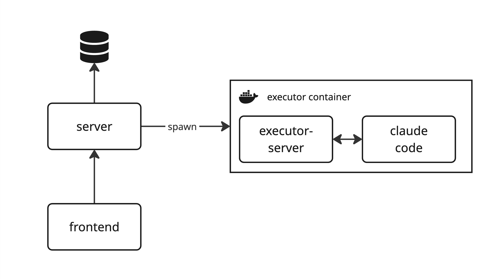

# claude-code-runner

claude-code-runner allows to run Claude Code as an agent in the background. Define tasks and launch tasks against repositories.

## General architecture

- **Server** stores prompts and message history in database, spawns Docker containers for task execution (executors)
- **Frontend** is a UI to create prompt, execute tasks against repositories and inspect task runs (messages and actions performed by claude code)
- **Executor container** is a Docker container built on top of [claude code's devContainer](https://github.com/anthropics/claude-code/blob/main/.devcontainer/Dockerfile) provisionned with tooling for Claude and a firewall
  - **executor server** is a small NodeJS server that allows communication from and to the executor container, starts claude-code, relays messages and perform initial git setup
